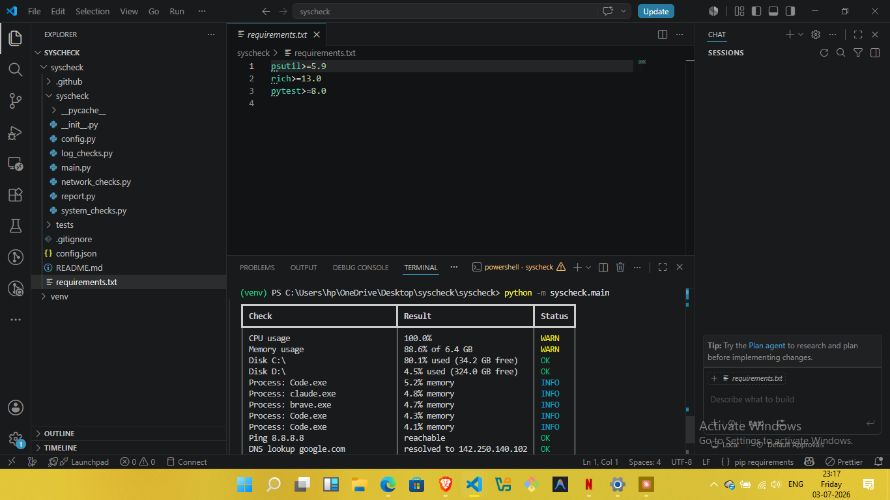
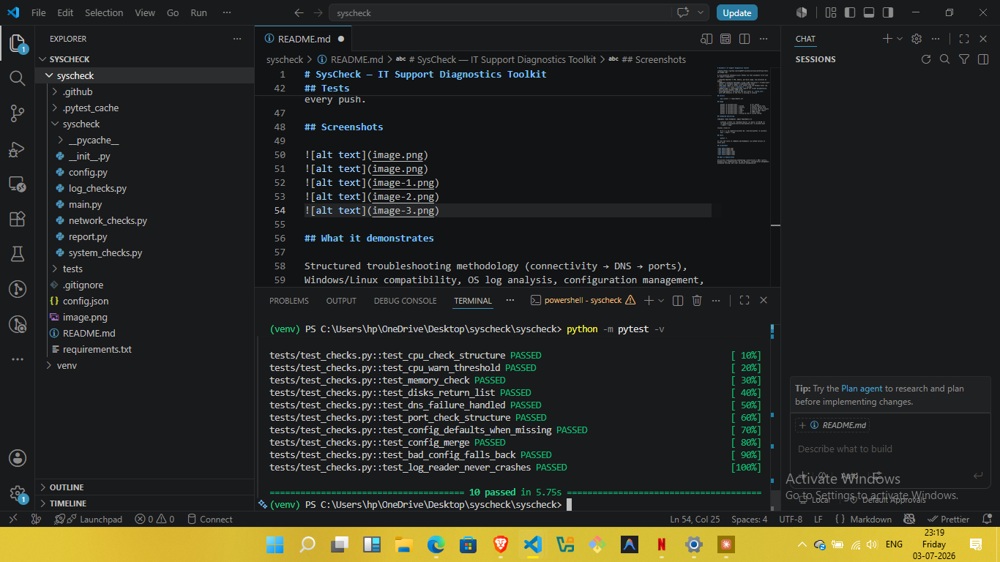

# SysCheck — IT Support Diagnostics Toolkit

A cross-platform (Windows/Linux) Python CLI that automates first-line
IT support diagnostics:

- **System health** — CPU, memory, per-disk usage, top processes by memory
- **Network isolation testing** — ping → DNS resolution → firewall/port
  checks, in standard support troubleshooting order
- **OS event logs** — recent error events from the Windows Event Log
  (`wevtutil`) or Linux (`journalctl` / syslog)
- **Reporting** — timestamped HTML reports for ticket documentation,
  plus machine-readable JSON output
- **Configurable** — thresholds and test hosts in `config.json`,
  with safe defaults if the file is missing or invalid

## Install

    pip install -r requirements.txt

## Usage

    python -m syscheck.main                  # all checks
    python -m syscheck.main --system         # system health only
    python -m syscheck.main --network        # network checks only
    python -m syscheck.main --logs           # include OS error events
    python -m syscheck.main --report         # save an HTML report
    python -m syscheck.main --json           # JSON output
    python -m syscheck.main --config my.json # custom config

## Scheduled monitoring

**Windows (Task Scheduler, admin PowerShell):**

    schtasks /create /tn "SysCheck Daily" /sc daily /st 09:00 /tr "C:\path\to\syscheck\venv\Scripts\python.exe -m syscheck.main --report --logs"

**Linux (cron):**

    0 9 * * * cd /path/to/syscheck && ./venv/bin/python -m syscheck.main --report --logs

## Tests

    pytest -v

CI runs the suite on **Ubuntu and Windows** via GitHub Actions on every push.

## Screenshots

## What it demonstrates

Structured troubleshooting methodology (connectivity → DNS → ports),
Windows/Linux compatibility, OS log analysis, configuration management,
automated testing, and clear technical documentation.
